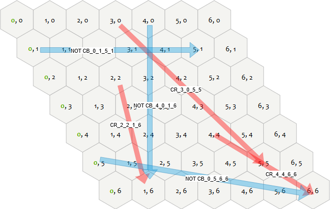

# IKT 457 Tsetlin machine based hex game winner prediction

## Content
- [prototypes](./prototypes/): This folder contains earlier versions and experimentation.

- [hex_tm.py](./hex_tm.py): Code for training the tsetlin machine.

- [sandbox.py](./sandbox.py): This code has been used to create plots, and to experiment with different things.

- [utils.py](./utils.py): Various functions that have been used throughout the project.

- [game_capture.py](./game_capture.py): Script for recording games from [lutanho.net](https://lutanho.net/play/hex.html).

- [hexgamegenerator.py](./hexgamegenerator.py): Algorithm for generating completed games for a arbitary sized board.

- [dataset](./dataset/): This folder contains datasets that have been used in this project. The dataset for completed games can be downloaded from [kaggle](https://www.kaggle.com/datasets/cholling/game-of-hex).

- [diagrams](./diagrams/): This folder contains [drawio](https://app.diagrams.net/) diagrams that have been used in the report.

- [captured](./captured/): This folder contains games that have been captured by the [game_capture.py](./game_capture.py) script.

- [images](./images/): This folder contains images that have been used in the report, or in the earlier presentations.

- [report](./report/): This folder contains the report for the project.

## Dependencies
- [Graph tsetlin machine](https://github.com/cair/GraphTsetlinMachine) 0.3.1
- Networkx 3.3
- Numpy 1.26.4
- Matplotlib 3.9.2
- Pandas 2.2.2
- scikit-image 0.24.0
- scikit-learn 1.5.1