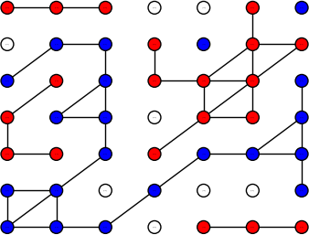
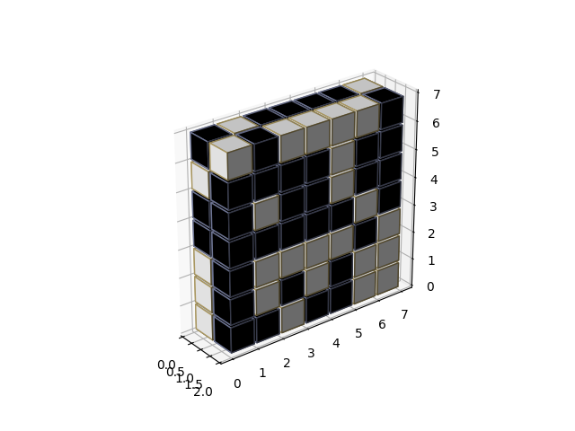

## 1 The dataset
The dataset that we have used consist of 1 million final positions of completed 7x7 hex games. Each row consist of a position and the winner. Example:
```
[-1,1,0,0,-1,-1,1,0,1,1,-1,-1,1,1,0,1,1,-1,1,1,0,1,1,-1,1,0,-1,0,-1,0,1,-1,1,0,-1,-1,1,0,-1,1,-1,-1,1,-1,0,1,-1,0,-1,1]
```
The first 49 entries represent what piece occupy the cells on the board. The 50th entry contains the winning side. 1 for black and -1 for white.

## 2 Representing the board and pieces
The dataset can be represented as a 2-dimensional array whereas entries 0 to 6 contain the first row, 7-13 contain the 2nd row and so on.

```
[[-1 -1 -1  0  0 -1  1]
 [ 0  1  1 -1  1 -1 -1]
 [ 1 -1  1 -1 -1 -1  1]
 [-1  1  1  0 -1 -1  1]
 [-1 -1  1 -1  1  1  1]
 [ 1  1  0  1  0  0  1]
 [ 1  1  1  0 -1 -1 -1]]
```

### 2.1 On the hex board


### 2.2 As a graph with connections

The goal of the blue player is to connect the first with the last column, and the goal of the red player is to connect the first and the last row.

## 4 Solutions
We have tested two different approaches. 
### 4.1 Using convolution
This is based on the tutorial code in MNISTConvolutionDemo.py. Instead of the MNIST dataset, we fed it the hex board dataset.  
The board needs to be booleanized first and we did this by an approach that was mentioned by Audun Linjord Simonsen
Ole Andre Haddelands masters thesis from 2020. So our 7x7 matrix
```
[[-1 -1 -1  0  0 -1  1]
 [ 0  1  1 -1  1 -1 -1]
 [ 1 -1  1 -1 -1 -1  1]
 [-1  1  1  0 -1 -1  1]
 [-1 -1  1 -1  1  1  1]
 [ 1  1  0  1  0  0  1]
 [ 1  1  1  0 -1 -1 -1]]
```
 becomes a 7x14 matrix:

```
[[1. 1. 1. 0. 0. 1. 0. 0. 0. 0. 0. 0. 0. 1.]
 [0. 0. 0. 1. 0. 1. 1. 0. 1. 1. 0. 1. 0. 0.]
 [0. 1. 0. 1. 1. 1. 0. 1. 0. 1. 0. 0. 0. 1.]
 [1. 0. 0. 0. 1. 1. 0. 0. 1. 1. 0. 0. 0. 1.]
 [1. 1. 0. 1. 0. 0. 0. 0. 0. 1. 0. 1. 1. 1.]
 [0. 0. 0. 0. 0. 0. 0. 1. 1. 0. 1. 0. 0. 1.]
 [0. 0. 0. 0. 1. 1. 1. 1. 1. 1. 0. 0. 0. 0.]]
```
The first 7 columns can be treated as layer 1 and the last 7 columns can be treated as layer 2. Then we get a sort of 3 dimensional board representation whereas each layer represent the color of the player:

.

This solution is based on doing convolution with patch size 5 on each layer.

#### Result


#### Code
[hexgameV2.py](./hexgameV2.py)

### 4.2 Using connectivity and empty spaces as features
This technique is based on the combination of connections between nodes and empty slots. Preprocessing is done on the dataset to extract features before training and inference. For a 7x7 board, it uses $2\cdot 7^4 + 7^2 = 4900$ features. We used a vanilla TM for this approach.

#### Result


#### Code
[hexgameV4.py](./hexgameV4.py)